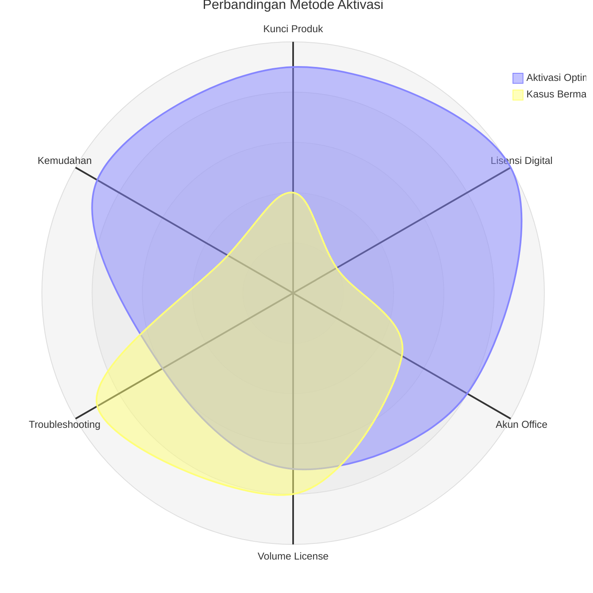

Panduan lengkap untuk mengaktifkan produk Microsoft dengan mudah dan aman.

### 🔑 1. Aktivasi dengan Kunci Produk
## 📊 Analisis Metode Aktivasi

## Penjelasan Diagram:
1. Sumbu Analisis:
   * **Kunci Produk**: Keandalan aktivasidengan kode 25 digits.
   * **Lisensi Digital**: Aktivasi Otomatis perangkat baru(OEM).
   * **Akun Office**: Aktivasi via akun microsoft.
   * **Volume Lisensi**: Sistem aktivasi corporate.
   * **Troubleshooting**: Kompleksitas perbaikan error.
   * **Kemudahan**: Tingkat kesulitan prosedur.
2. Kurva:
   * **Aktivasi Optimal:
     * Skor tinggi dikemudahan dan lisensi digital.
     * Skor rendah di troubleshooting(minimal masalah).
   *  Kasus Bermasalh:
     * Skor tertitnggi di troubleshooting(banyak error).
     * Skor rendah di kemudahan dan lisesni digital.

| Metode            | Keunggulan                  | Risiko                    |
|-------------------|----------------------------|----------------------------|
| Kunci Produk      | Keandalan tinggi           | Kunci bisa expired         |
| Lisensi Digital   | Otomatis, tanpa intervensi | Hanya untuk perangkat baru |
| Akun Office       | Terintegrasi cloud         | Ketergantungan akun MS     |
| Volume License    | Cocok untuk perusahaan     | Konfigurasi kompleks       |

## 💡 Tips: Untuk aktivasi paling stabil (area terluas diagram), gunakan kombinasi:
1. **Lisensi Digital** untuk windows.
2. **Akun Office** untuk Microsoft 365.

### Penjelasan implementasi:
1. **Sumbu (axis)**:
   - Menggunakan 6 parameter relevan aktivasi software
   - Label dalam format `kode["Label Penuh"]`
   - Kode singkat untuk memudahkan pembacaan diagram

2. **Kurva (curve)**:
   - Dua skenario berbeda (aktivasi sukses vs bermasalah)
   - Nilai numerik dalam kurung `{}` sesuai urutan sumbu
   - Warna otomatis berbeda tiap kurva

3. **Skala**:
   - `max 10` : skala maksimum
   - `min 0` : skala minimum
   - Rentang nilai 0-10 untuk konsistensi

4. **Best Practice**:
   - Area terluas menunjukkan konfigurasi terbaik
   - Poligon simetris cenderung ideal
   - Overlapping area menunjukkan potensi masalah

Diagram ini cocok untuk:
- Memvisualisasikan kompleksitas aktivasi
- Membandingkan metode berbeda
- Mengidentifikasi titik rawan error
- Bahan edukasi untuk user akhir